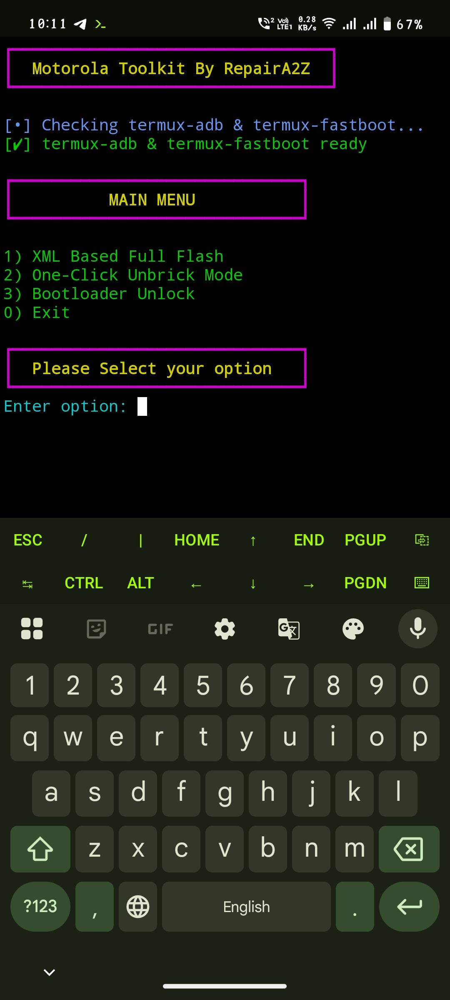

# Moto-Toolkit
Flash XML firmware, unlock bootloader, Unbrick device without pc 


# installation :- 

```Install``` [termux](https://f-droid.org/repo/com.termux_1022.apk)
```apk```
```console
yes | pkg update && upgrade
```
```console
yes | pkg install git
```

# clone tool to termux :-

```console
git clone https://github.com/Ishu43642/Moto-Toolkit.git
```

```console
cd Moto-Toolkit
```
```console
chmod +x moto-toolkit.sh
```

# Run Tool 

```console
./moto-toolkit.sh
```

# GUI Mode Use

```console
./moto-gui.sh
```

# Tool Feature 
1. 🔓 Moto Bootloader Unlock 

2. ⬇️ Flash motorola XML firmware 

3. 📴 one click unbrick device

4. 🚫 No need Pc Fix & unlock your device without pc 
